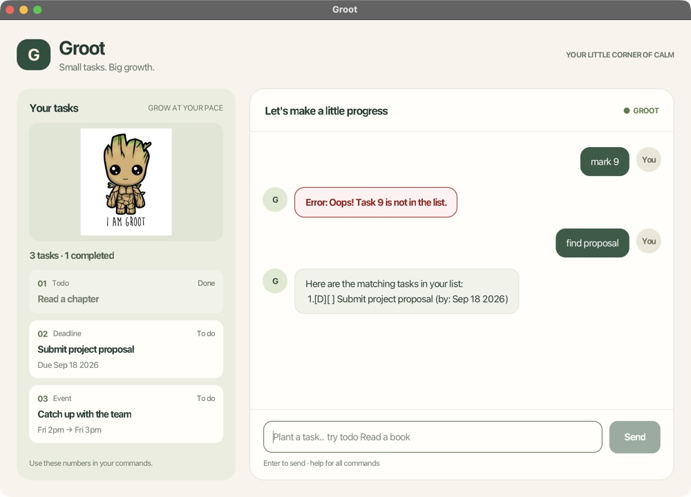

# Groot User Guide

Groot helps you keep track of todos, deadlines, and events. Type a command, press **Enter**
or click **Send**, and Groot replies in the chat. Your tasks are saved automatically.

The **Your tasks** panel on the left keeps your list in view, with task numbers, types,
schedules, completion status, and total/completed counts. It is read-only: use commands
in the chat to make changes. The panel and chat scroll independently.



[Getting started](#getting-started) · [Commands](#commands) · [Task numbers](#reading-your-task-list)
· [Sorting](#sorting-deadlines-c-sort) · [Troubleshooting](#saving-and-troubleshooting)

## Getting started

1. Install **Java 25**. For the development setup, use a Java 25 distribution with JavaFX.
2. Get the current project from [the Groot repository](https://github.com/wtvlol/ip).
   In the project folder, run `./gradlew shadowJar` on macOS/Linux or `gradlew.bat shadowJar`
   on Windows. This creates `build/libs/groot.jar`.
3. Put `groot.jar` in a folder where you can save files. Open a terminal in that folder and run:

   ```shell
   java -jar groot.jar
   ```

4. Try `todo Read a book`, followed by `list`. Enter `help` whenever you need a reminder.

Use the same folder each time you start Groot so it finds your saved tasks.
The older release on GitHub may not include the current GUI; building the current source
as above gives you the version described here.

## Commands

Replace uppercase placeholders with your own text; do not type the placeholder names.
Descriptions may contain spaces. Use lowercase command names and spaces between a command
and its arguments. `sort` also accepts uppercase letters and tabs.

| What you want to do | Command | Example |
| --- | --- | --- |
| Add a task without a date | `todo DESCRIPTION` | `todo Read a book` |
| Add a deadline | `deadline DESCRIPTION /by YYYY-MM-DD` | `deadline Submit report /by 2026-09-18` |
| Add an event | `event DESCRIPTION /from START /to END` | `event Team meeting /from Fri 2pm /to Fri 3pm` |
| Show all tasks | `list` | `list` |
| Find tasks by description | `find KEYWORD` | `find report` |
| Mark a task as done | `mark NUMBER` | `mark 2` |
| Mark it as not done | `unmark NUMBER` | `unmark 2` |
| Delete a task | `delete NUMBER` | `delete 2` |
| Show deadlines, earliest first | `sort` | `sort` |
| Show deadlines, latest first | `sort -r` or `sort --reverse` | `sort -r` |
| Show command help | `help`, `--help`, or `-h` | `help` |
| Say goodbye | `bye` | `bye` |

**Deadlines** require a real date in `YYYY-MM-DD` format. Groot displays it as, for example,
`Sep 18 2026`. A date such as `2026-02-30` is rejected.

**Events** store the start and end exactly as text, with surrounding spaces removed.
You can use dates or phrases such as `tomorrow 2pm`; Groot does not validate their order
or send reminders. Keep `/by`, `/from`, and `/to` for the separators in their respective commands.

**Finding tasks** ignores capitalization and matches any part of the description.
`find report` matches both `Submit report` and `REPORT review`; it does not search dates
or event times. A phrase such as `find team meeting` must appear together in the description.
No matches produces an empty matching-task list.

**Deleting is immediate**, with no confirmation or undo. Check the number with `list` first.

**Closing Groot:** close the GUI window using its close button. In the GUI, `bye` displays
a farewell but does not close the window. In console mode, `bye` exits the program.

## Reading your task list

After adding the three example tasks above, `list` shows:

```text
Here are the tasks in your list:
 1.[T][ ] Read a book
 2.[D][ ] Submit report (by: Sep 18 2026)
 3.[E][ ] Team meeting (from: Fri 2pm to: Fri 3pm)
```

`T` means todo, `D` means deadline, and `E` means event. `[ ]` means not done; `[X]` means done.
For example, `mark 2` marks **Submit report** as done, and `unmark 2` reverses that status.
Completed tasks stay in the list until you delete them.

Always use the numbers from **Your tasks** or **`list`** with `mark`, `unmark`, and `delete`.
Deleting a task shifts the later numbers; the panel updates automatically after each command.
`find` and `sort` change only the chat reply, so the panel always shows the main-list order.
**Search results are numbered separately**: a result numbered `1` by `find` may be task `2`
in the main list. Check the panel or run `list` to get its number before changing it.

## Sorting deadlines (C-Sort)

Use `sort` for earliest first, or `sort -r` / `sort --reverse` for latest first.
Completed deadlines are included; todos and events are omitted. If there are no deadlines,
Groot says so.

For example, if task `2` is due on September 18 and task `4` on September 12,
`sort` displays task `4` before task `2`. The displayed numbers remain the **main-list numbers**,
so `mark 4` still selects the September 12 deadline.

Deadlines with the same date are ordered alphabetically by description, ignoring capitalization.
Reverse changes date order only; equal names and dates keep their main-list order.
Sorting changes just the reply: it does not reorder saved tasks or affect the next `list`.

Use at most one reverse flag. `sort -x` or `sort -r --reverse` produces:

```text
Oops! Use: sort [-r | --reverse].
```

## Saving and troubleshooting

Tasks are stored in `data/groot.txt` under the folder where you start Groot.
Successful additions, status changes, and deletions are saved immediately; no save command is needed.
To back up your tasks, close Groot and copy that file somewhere safe.

| Situation | What to do |
| --- | --- |
| Wrong command, missing details, or invalid task number | Read the red **Error:** reply, correct the input, and try again. Use `help` for syntax or `list` for valid numbers. Rejected commands do not change tasks. |
| Blank input | Type a command; empty submissions are ignored in the GUI. |
| No saved file is found | Groot starts with an empty list and creates the file when you add a task. If you expected existing tasks, check that you launched it from the usual folder. |
| Groot cannot save | Check the folder is writable and there is free disk space, then retry. Groot rolls back the failed change. |
| Groot will not open because saved data is damaged or unreadable | Close Groot and make a backup of `data/groot.txt`. Restore a known-good copy and check file permissions. In console mode, malformed data reports the offending line; the GUI currently fails to open. Do not delete your only copy. |

To start fresh after backing up damaged data, move the original `groot.txt` out of the `data`
folder and reopen Groot. Your old tasks will remain in the backup, but will not appear in the new list.
